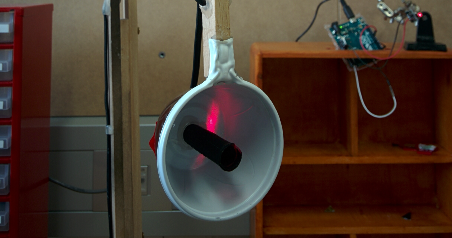
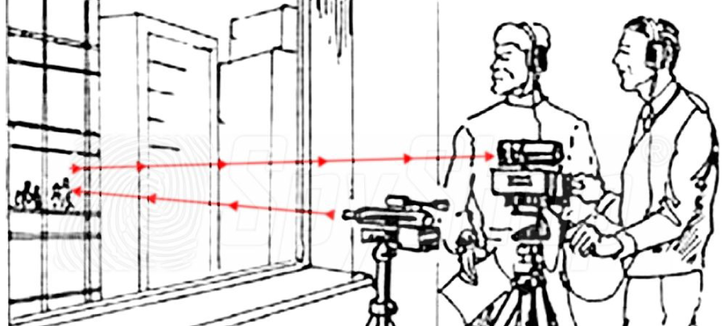

# Laserski mikrofon
Ko slišimo za laserski mikrofon, pogosto pomislimo na _tajne agente_ in _high-tech_ prisluškovalne naprave. Le te so navadno težko dostopna stvar, a laserski mikrofon ne spada v to kategorijo. Sestavimo ga lahko na vsaki mizi s spajkalnikom in osnovnimi elektronskimi komponentami.

##Kako deluje?
Najbolj očitna komponenta, ki jo potrebujemo, je **laser**. Tega bomo usmerili proti oddaljenemu objektu, ki je dober **odbojnik** svetlobe (zrcalo, okno, steklo na stenski sliki, ...) tako, da odbije laserski žarek nazaj v naš **dekoder**, ki svetlobo dekodira v zvok.
Zvok, ki nastaja v bližini odbojnika, povzroči, da odbojnik rahlo vibrira, kar opazimo kot majhne spremembe pozicije odbitega laserskega žarka. Takšne spremembe pomenijo nihanje količine svetlobe v neki točki. Če na to točko postavimo prej omenjeni dekoder, bomo slišali zvok.

## Laser
Dokler bo naš laserski mikrofon deloval v optimalnih pogojih (tj. odbojnik je zrcalo, razdalje so kratke, imamo možnost zatemnitve prostora), pri izbiri laserja ni potrebno posebej komplicirati.

Dovolj je že navaden rdeči laserski kazalnik ali cenen laserski modul, prirejen za Arduino. Pri slednjem sem naletel na težavo z napajanjem, saj je sčasoma izgubljal svojo svetilnost, kar sem do neke mere omilil tako, da sem ga namesto z napajalnikomo napajal z Arduino-m.

####Izboljšava
Seveda pravi vohuni ne bodo zadovoljni s prisluškovalno napravo, ki okno tarče osvetli z rdečo piko. V tem primeru je smiselno uporabiti IR laser, katerega svetloba je nevidna za človeško oko.

Rdeči laser še vedno potrebujemo za umerjanje sistema, zato ga le dodamo novemu IR laserju, pri čemer morata žarka obeh biti čimbolj vzporedna.

Dekoderja zaradi spremembe laserja ni potrebno predelovati, saj zaznava IR svetlobo še malenkost boljše kot rdeči laser. Več o tem v poglavju o dekoderju.

## Odbojnik

## Dekoder
!!UVOD!!
Vezje je pametno najprej sestaviti na protoboard-u, ga nato testirati, si zamisliti postavitev na stojalu in šele nato prispajkati
 
####Seznam delov
- upori:
   * 1kΩ
   * 10kΩ
- kondenzatorji:
   * 0.01μF
   * 10μF
   * 470μF
- potenciometer: 50 ali 100 kΩ
- fototranzistor: katerikoli NPN s prozornnim ohišjem
- ojačevalec zvoka: LM386 ali podoben čip
- 3,5mm audio jack socket za slušalke
- 9V baterija
- stikalo

####Shema

## Stojalo
!!postavitev, le del žarka na senzor!!

## Audacity
Prikaži Peak
Predvajaj zvok pred snemanjem
Filtri

##Težave

######V nadeljevanju:

Zakaj baterija namesto adapterja?

direkten izhod na zvočnik ne bo dal pravih rezultatov, priklopi na računalnik

drama z ojačevalcem in novim vezjem
 
jakost laserja + odboj na steklu/cdju/zrcalni membrani

kaj je to + uvod: za kaj je primeren, za kaj ni. kaj vse je treba upoštevati pri vzpostavitviji sistema