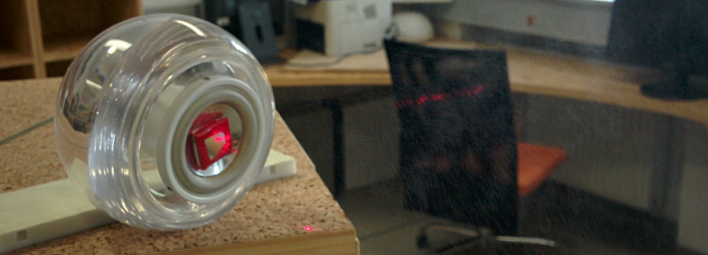
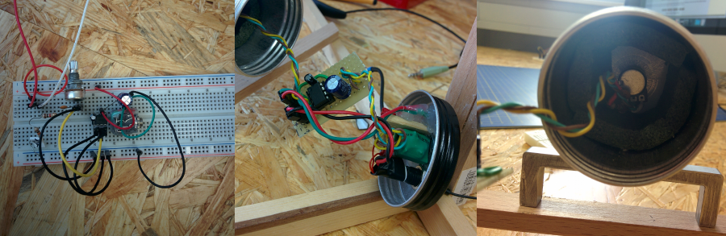
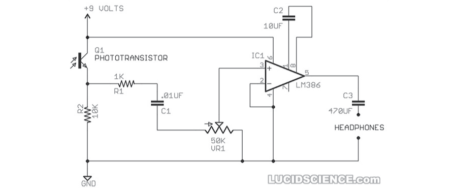
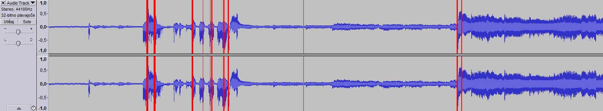

# Laserski mikrofon
Ko slišimo za laserski mikrofon, pogosto pomislimo na _tajne agente_ in _high-tech_ prisluškovalne naprave. Le te so navadno težko dostopna stvar, a laserski mikrofon ne spada v to kategorijo. Sestavimo ga lahko na vsaki mizi s spajkalnikom in osnovnimi elektronskimi komponentami.

##Kako deluje?
Najbolj očitna komponenta, ki jo potrebujemo, je **laser**. Tega bomo usmerili proti oddaljenemu objektu, ki je dober **odbojnik** svetlobe (zrcalo, okno, steklo na stenski sliki, ...) tako, da odbije laserski žarek nazaj v naš **dekoder**, ki svetlobo dekodira v zvok.

Zvok, ki nastaja v bližini odbojnika, povzroči, da odbojnik rahlo vibrira, kar opazimo kot majhne spremembe pozicije odbitega laserskega žarka. Takšne spremembe pomenijo nihanje količine svetlobe v neki točki. Če na to točko postavimo prej omenjeni dekoder, bomo slišali zvok.

####Uporabnost v praksi
[//]: # (TODO: kaj je to + uvod: za kaj je primeren, za kaj ni. kaj vse je treba upoštevati pri vzpostavitviji sistema, bin laden)

## Laser
Dokler bo naš laserski mikrofon deloval v optimalnih pogojih (tj. odbojnik je zrcalo, kratka razdalja, možnost zatemnitve prostora), pri izbiri laserja ni potrebno posebej komplicirati.

Dovolj je že navaden rdeči laserski kazalnik ali cenen laserski modul, prirejen za Arduino. Pri slednjem sem naletel na težavo z napajanjem, saj je sčasoma izgubljal svojo svetilnost, kar sem do neke mere omilil tako, da sem ga namesto z napajalnikom napajal z Arduino-m.

Laser postavimo tako, da ga bomo kasneje lahko premikali. To nam bo prišlo prav kasneje, ko bomo laser usmerjali v odbojnik.

####Izboljšava
Seveda pravi vohuni ne bodo zadovoljni s prisluškovalno napravo, ki okno tarče osvetli z rdečo piko. V tem primeru je smiselno uporabiti IR laser, katerega svetloba je nevidna za človeško oko.

Rdeči laser še vedno potrebujemo za umerjanje sistema, zato ga le dodamo novemu IR laserju, pri čemer morata žarka obeh biti čimbolj vzporedna.

Dekoderja zaradi spremembe laserja ni potrebno predelovati, saj zaznava IR svetlobo še malenkost boljše kot rdeči laser. Več o tem v poglavju o dekoderju.

## Odbojnik
Odbojnik za testiranje naše naprave naredimo tako, da na membrano zvočnika prilepimo majhno zrcalo, če ga nimamo, bo zadostoval tudi košček starega CD-ja. V vsakem primeru mora biti zrcalo prilepljeno trdno na membrano, drugače pride do popačenja prejetega zvoka. 

Pri rezanju CD-ja je potrebno paziti, da folija ne odstopi od plastike, zato namesto škarij raje uporabimo električno žagico, ki plastiko med rezanjem malenkost stopi.

Zvočniki, ki imajo celo ali del membrane že srebrne barve, se niso izkazali kot uporabni odbojniki sami po sebi, zato jih je še vedno treba opremiti z zrcalom. 

## Dekoder
Čas za spajkanje! Seveda je pred tem pametno, da vezje najprej sestavimo na protoboard-u, ga testiramo in si zamislimo postavitev na stojalu. Ker imamo med testiranjem opravka z veliko žicami in ojačevalcem zvoka, ni nič nenavadnega, če naletimo na kakšne motnje ali celo na zvok kakšne FM radijske postaje.

Če bo potenciometer postavljen ločeno od ostalega vezja, je zaradi zmanjšana motenj priporočljivo, da skupaj povežemo upor R1 in kondenzator C1 in ju nato povežemo neposredno na potenciometer, tri žice, ki ga povezujejo z vezjem, pa ovijemo eno okrog druge, kot poleg protoboard-a in končnega vezja v ohišju prikazuje spodnja slika.

 
####Seznam delov
- upori:
   * 1kΩ
   * 10kΩ
- kondenzatorji:
   * 0.01μF
   * 10μF
   * 470μF
- potenciometer: 50 ali 100 kΩ
- fototranzistor: katerikoli NPN s prozornnim ohišjem
- ojačevalec zvoka: LM386 ali podoben čip
- 3,5mm audio jack socket za slušalke
- baterija od 3V do 9V
- stikalo

####Shema

## Stojalo
Stojalo za dekoder mora biti prilagodljivo po višini in naklonu, stabilno in trdne konstrukcije. Fotografsko stojalo ustreza vsem pogojem, a če ga nimamo pri roki, lahko sestavimo podobnega temu na spodnji sliki levo.

Ker vsak tresljaj pomeni motnjo, z vsakim premikom stojala pa tvegamo izgubo ali slabši sprejem zvoka, se splača ločiti fototranzistor od ostalega vezja, le to postavimo nekam blizu tal.

Na ta način pri nastavljanju potenciometra ne tresemo stojala, v primeru zibanja stojala pa se le-to hitreje umiri, saj je najvišji del mnogo lažji.

Sprejemni del, viden na spodnji sliki desno, je sestavljen iz kavnega lončka, ki s svojo belo notranjostjo uporabniku pomaga usmeriti laser v sprejemnik na sredini in iz črnega ročaja kemičnega svinčnika, ki zmanjšuje vstop svetlobe stropnih luči.

##Zajem zvoka
Laserski mikrofon najlažje uporabljamo v kombinaciji z računalnikom, saj nam omogoča vizualni prikaz, shranjevanje in procesiranje zvoka. Uporabili bomo brezplačen program [Audacity](http://www.audacityteam.org/ "Audacity-jeva domača stran")

Dekoder povežemo z računalnikom s _3,5mm male to male audio_ kablom, ki ga priklopimo v _Line In_ vhod.

####Prvi koraki
Uporaba programa je sila preprosta. Pred uporabo se prepričamo, da imamo izbran pravi vhod (Line In) in izhod (privzeto) zvoka, preverimo, da sta jakosti snemanja in predvajanja za začetek nastavljeni na maksimum in že lahko pritisnemo rdeč gumb in naredimo svoj prvi posnetek.

Zvočno sled posnetka lahko povečamo in prilagodimo oknu z ukazoma
`Pogled -> Prilagodi oknu (Ctrl + F)` in 
`Pogled -> Prilagodi navpično (Ctrl + Shift + F)`.

####Opazovanje
Ta funkcija nam omogoča poslušanje dekodiranega zvoka v realnem času. To nam pomaga pri nastavljanju celotnega sistema, saj ga opravljamo s poiskušanjem. 

Vklopimo jo s klikom na tisto ikono mikrofona, ki ima puščico in izberemo `Začni opazovanje (Start Monitoring)`.

####Določanje glasnosti snemanja
Pri poslušanju zajetega zvoka bomo po vsej verjetnosti opazili, da le ta na nekaterih mestih hrešči. Proti temu se borimo z nastavljanjem glasnosti snemanja, kar storimo s premikanjem drsnika pri ikoni mikrofona skrajno levo v orodni vrstici.

V veliko pomoč nam bo funkcija Pokaži rezanje, ki jo vklopimo z klikom na `Pogled -> Pokaži rezanje (View -> Show Clipping)`. Sedaj imamo na sledi z rdečo barvo označena mesta, kjer bomo slišali hreščeč zvok.

####Filtri

####Pravilna postavitev sistema

##Težave
Pri gradnji sem naletel na mnoge težave, nekaterih še nisem omenil, zato so opisane tukaj, skupaj z njihovimi rešitvami.

####Brum
Zvok, ki ga tvori dekodirnik, navadno ni nikoli čisto brez bruma (brnenja v ozadju). Če za napajanje uporabimo napajalnik, ki je priklučen v 220V vtičnico, opazimo, da na zvok vplivajo naprave, ki so priklučene v vtičnice v bližini. 
Najenostavnejša rešitev je ta, da napajalnik zamenjamo z ustrezno baterijo. Tako je sistem bolj mobilen in neodvisen od električnih naprav v okolici.

Opazil sem tudi, da brum prav tako povzročajo napetosti, višje od 3V. Ko sem vzporedno z vezjem vezal LED diodo z ustreznim uporom, se je stanje opazno popravilo.

####Ali moje vezje sploh deluje?!
Na začetku gradnje dekoderja sem vezje testiral z zvočnikom namesto z računalnikom. To se je izkazalo za veliko napako, saj je bil zvok zaradi neoptimalne postavitve prešibek, da bi ga lahko slišal na zvočniku in sem zato porabil kar nekaj časa za iskanje neobstoječe napake v vezju. Računalnik je zato veliko boljša izbira, saj z grafično ponazoritvijo zvoka zlahka opazimo razliko med tišino in zvokom.
